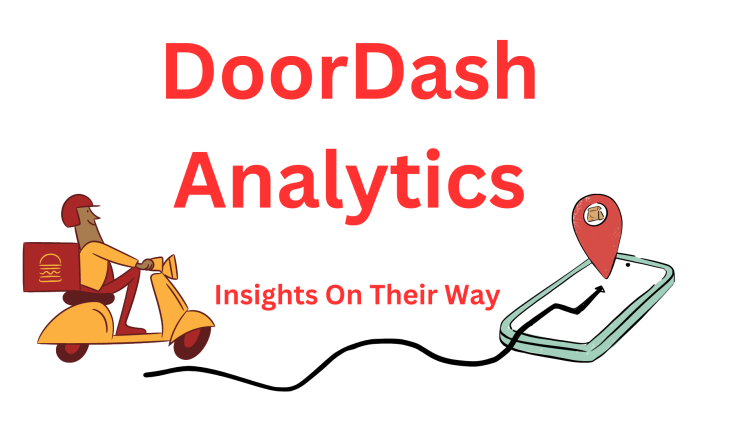

# Welcome to My Portfolio

---

### Learn About My Projects

---
#### [Massachusetts Education Overview](https://public.tableau.com/app/profile/dava.betts/viz/MassachusettsEducationOverview_16921526478260/MassachusettsEducationOverview)

The main focuses were:
What schools are struggling the most?
How does class size affect college admission?
What are the top math schools in the state? 
#### [Massachusetts Education Overview Article](https://www.linkedin.com/pulse/massachusetts-school-project-dava-betts/?trackingId=rdGItH05SRC%2BeCdSE5Nc2w%3D%3D)

 

---
#### [DoorDash Analysis | Excel](https://www.linkedin.com/pulse/doordash-analytics-dava-betts/?trackingId=ddRZgjmQRfmBDQOCuJKJFQ%3D%3D)

 

---
#### [World Bank Project | SQL]([https://www.linkedin.com/pulse/show-me-money-dava-betts/?published=t)]

In this project from Data Analytics Accelerator, I was prompted to analyze the financial state of various countries and the amounts owed to the IDA. You can find the full article here.
https://www.linkedin.com/pulse/show-me-money-dava-betts/?published=t

---

### SQL Projects

- [WSDA Music | SQL](https://github.com/DavaBetts/SQL/blob/main/WSDA_Music.db)
- [Customer & Order Analytics | SQL](https://github.com/DavaBetts/SQL/blob/main/Customer%20and%20Order%20Analytics)
- [Create Grocery List Table | SQL](https://github.com/DavaBetts/SQL/blob/main/Grocery%20Store%20Database%20and%20Stats)
- [Airline Reviews](https://github.com/DavaBetts/SQL/blob/main/Airline_Reviews)

---

